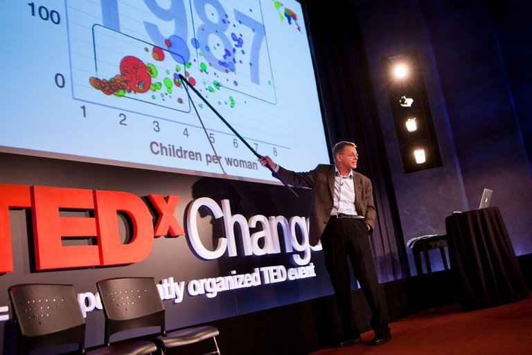
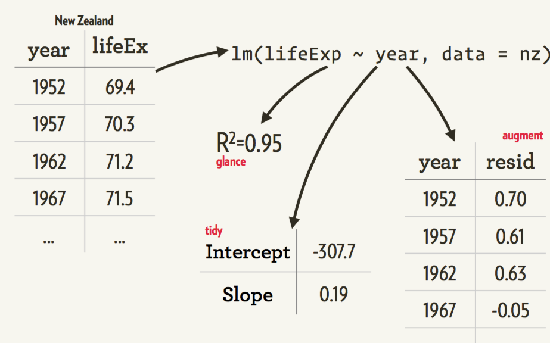
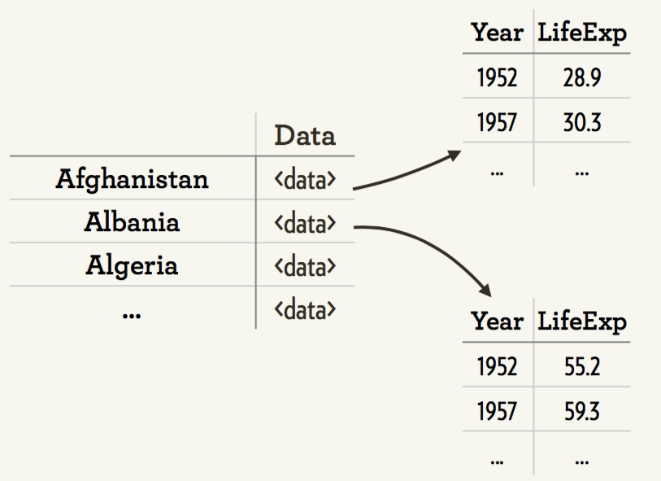

```{r, include=FALSE}
library(knitr)
knitr::opts_chunk$set(warning = FALSE,
                      echo = TRUE,
                      message = FALSE,
                      collapse = FALSE,
                      comment = "#>",
                      fig.align='center',
                      cache=FALSE)
## knitr::opts_knit$set(root.dir = '.')
library(data.table)
library(magrittr)
library(readr)
library(dplyr)
library(tidyr)
library(ggplot2); theme_set(theme_grey()) 
library(ggrepel)
```


## <br/><br/>More ggplot2 with tidyverse {.white}


<p class="white">
`r Sys.Date()`<br/>
<p style='color:white'>
  [Leo Lu](https://github.com/leoluyi)
</p>
</p>


## <br/><br/> {.white}


## How to use this slides

- Press **Esc** to navigation mode
- Press **pageDown**, **Right** or **Down** to go to next slide
- Presss **PageUP**, **Left** or **Up** to go to previous slide

## 大綱

- 複習 ggplot2
- Tidyverse
- ggplot2 FAQ

# 複習 ggplot2

## Aesthetic Mapping

- 在 Grammar of Graphics 裡面最重要的概念就是 "Aesthetic Mapping"
- 在畫圖前我們先來練習用眼睛👀看 aethetics

## Aesthetics 基本題 1

>- x = displ
>- y = hwy
>- color = class

```{r, echo=FALSE}
ggplot(data = mpg) +
  geom_point(mapping = aes(x = displ, y = hwy, color = class), size = 3)
```


## Aesthetic Mappings

在 x-y 二維的 Scatterplot 加入第三個 aesthetic

- 把 class 對應到點的**顏色**
- hint: `?geom_point`: 查詢支援的 aesthetics


## Aesthetic Mappings

- x = displ
- y = hwy
- color = class

```{r}
ggplot(data = mpg) +
  geom_point(mapping = aes(x = displ, y = hwy, color = class))
```


## Aesthetics 基本題 2

>- x = displ
>- y = hwy
>- alpha (透明度) = class

```{r, echo=FALSE}
ggplot(data = mpg) +
  geom_point(mapping = aes(x = displ, y = hwy, alpha = class), size = 3)
```


## Aesthetic Mappings

```{r, eval=FALSE}
ggplot(data = <DATA>) + # Data
  geom_<xxx>(
     mapping = aes(<MAPPINGS>), ##  <= Aesthetic mappings
     stat = <STAT>,
     position = <POSITION>
  ) +
  scale_<xxx>() + coord_<xxx>() + facet_<xxx>()
  theme_()
```

- `aes()` 可以放在：
    - `ggplot()`裡面 -- **有**<underline>"記憶效果"</underline>(成為所有圖層預設帶入)
    - 外面 `+ aes()` -- **有**<underline>"記憶效果"</underline>(成為所有圖層預設帶入)
    - `geom_<xxx>()`裡面 -- **無**"記憶效果"(只對該 geom 有效)
- `geom_<xxx>(inherit.aes=FALSE)`: overrides the default aesthetics.


## Static Aesthetic

有時候你可能只想要手動設定某個<underline>固定 aesthetic</underline>，這個例子的設定只為了美觀，
並不會帶出多餘資料訊息。

- 將 aesthetic 放在 aes() 裡面: map aesthetic 並自動建立 legend
- 將 aesthetic 放在 aes() 之外: 手動設定某個固定 aesthetic

```{r}
ggplot(data = mpg) +
  geom_point(mapping = aes(x = displ, y = hwy), color = "blue")
```


# Visualise the model

## The best stats you've ever seen | Hans Rosling { .fullpage }

<a href="https://www.youtube.com/watch?v=hVimVzgtD6w" target="_blank"></a>

## Take a look at our data

```{r}
library(gapminder)
gapminder
```

## Our ggplot

```{r echo=FALSE}
library(gapminder)
ggplot(gapminder, aes(year, lifeExp, group = country)) +
  geom_line() +
  ggtitle("Life expectanty by each country")
```


## Fit a model to each country { .fullpage }



## R packages

1. Nested data (`tidyr`)
2. Functional programming (`purrr`)
3. Models → tidy data (`broom`)

## Split our data into data.frames by group



## Split our data

```{r}
library(dplyr)
library(tidyr)

gapminder <- gapminder %>% mutate(year1950 = year - 1950)
by_country <- gapminder %>% 
  group_by(continent, country) %>% 
  nest

by_country
```

## Fit a model within each country

```{r eval=FALSE}
lm(lifeExp ~ year, data = Afghanistan)
lm(lifeExp ~ year, data = Afghanistan)
...

```

## We can use purrr::map() to fit each model

```{r}
library(purrr)

country_model <- function(df) {
  lm(lifeExp ~ year1950, data = df)
}

models <- by_country %>%
  mutate(mod_lm = map(data, country_model))

models
```

## What can we extract from each model?


## Extract info from model

```{r}
models <- models %>% 
  mutate(
    glance = mod_lm %>% map(broom::glance),
    tidy = mod_lm %>% map(broom::tidy),
    augment = mod_lm %>% map(broom::augment),
    rsq = glance %>% map_dbl("r.squared")
  )
models
```

## See the R^2

```{r, echo=TRUE ,fig.asp=1.35}
models %>% 
  ggplot(aes(rsq, reorder(country, rsq))) +
  geom_point(aes(colour = continent))
```

## Unnest to a regular data frame

```{r}
models %>% unnest(data)
```

## Unnest to a regular data frame

```{r}
models %>% unnest(glance, .drop = TRUE)
```

## Unnest to a regular data frame

```{r}
models %>% unnest(tidy, .drop = TRUE)
```


## Plot the models

```{r}
models %>% 
  unnest(tidy) %>% 
  select(continent, country, term, estimate, rsq) %>% 
  spread(key = term, value = estimate) %>% 
  ggplot(aes(`(Intercept)`, year1950)) +
  geom_point(aes(colour = continent, size = rsq)) +
  geom_smooth(se = FALSE)
```

## Plot the models: augmented

```{r}
models %>% 
  unnest(augment) %>% 
  ggplot(aes(year1950, .resid)) +
  geom_line(aes(group = country), alpha = 0.3) +
  geom_smooth(se = FALSE) +
  geom_hline(yintercept = 0, colour = "red", alpha = 0.7) +
  facet_wrap(~continent)
```


## Quick Recap

1. `tidyr`: 把物件 (例如 lm) 用 list 存在 columns 裡面
2. `purrr`: Functional programming
3. `broom`: Models → tidy data


# ggplot2 FAQ

## How do I manually change the key labels in a legend in ggplot2

```{r}
library(ggplot2)

## data
set.seed(2016)
grp <- gl(n=4, k=20, labels=c("group a","group b","group c", "group d"))
value <- runif(n=80, min=10, max=150)
outcome <- cut(value,2)
(data <- data.frame(grp,value,outcome))


## Origianl plot

ggplot(data, aes(grp, fill=outcome)) + 
  geom_bar() + 
  xlab("group") +
  ylab("number of subjects") + 
  labs(fill = "Serologic response")


# Change the displayed labels for groups

# The standard way is to use the scale functions to change the displayed labels for groups. You can replace your ggplot call with

ggplot(data, aes(grp, fill=outcome)) +
  geom_bar() +
  xlab("group") +
  ylab("number of subjects") +
  scale_fill_discrete(name="Serologic response",
                      breaks=levels(data$outcome),
                      labels=c("double negative", "positive for a and/or b"))

# Note that the scale's title has been incorporated into the scale_fill_discrete call. You can do this with the "axes" too, if you like

ggplot(data, aes(grp, fill=outcome)) +
  geom_bar() +
  scale_x_discrete("group") +  # x-axis name
  scale_y_continuous("number of subjects") + # y-axis name
  scale_fill_discrete(name="Serologic response",
                      breaks=levels(data$outcome),
                      labels=c("double negative", "positive for a and/or b"))
```

## Change the order of a discrete x scale?

沒有排序的 bar chart 很難看

- 要怎麼排序？
- `reorder(<要排序的變數>, <參照大小>)`  
  ＊只能用在手動算的方式

```{r, collapse=TRUE, fig.width=6}
d <- mpg %>% 
  group_by(class) %>% 
  summarise(n = n())
d

ggplot(data = d) +
  geom_bar(mapping = aes(x = reorder(class, -n), y = n),
           stat = "identity")
```

## Reference

- [Top 50 ggplot2 Visualizations](http://r-statistics.co/Top50-Ggplot2-Visualizations-MasterList-R-Code.html)
- [Hadley Wickham: Managing many models with R](https://www.youtube.com/watch?v=rz3_FDVt9eg)
- [PLOTCON 2016: Hadley Wickham, New open viz in R](https://www.youtube.com/watch?v=cU0-NrUxRw4)
- [Hadley Wickham "Data Science with R"](https://www.youtube.com/watch?v=K-ss_ag2k9E)
- [Cookbook for R](http://www.cookbook-r.com/Graphs/)

